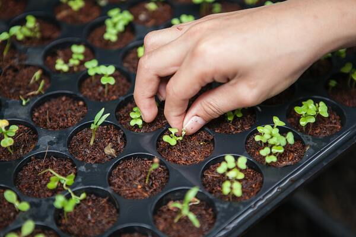

# Semillas al viento



## :point_up: Antes de empezar: algunos consejos

En este ejercicio se pide que asuman el rol de quien debe _corregir_ o _revisar_ el código que escribió otra persona. Esto que puede parecer un juego de roles sin mucho sentido, es una actividad bastante habitual en el desarrollo de software y, por lo tanto, merece ser ejercitado.

La solución propuesta funciona, pero tiene algunos defectos hablando en términos de diseño de software. En particular, vamos a focalizarnos en algunos de los que están descriptos en el artículo [Cualidades de diseño independientes de la tecnología](https://surprograma.github.io/libro-disenio-oop/docs/cualidades-disenio/cualidades-independientes-tecnologia/) .

## :mag_right: Consigna

Este ejercicio tiene tres etapas, que explicamos a continuación y que **deben realizarse en el orden especificado**.

1. A partir del dominio y los requerimientos que se describen más abajo, **analizar la solución propuesta** y agregar en el código un **comentario por cada defecto** que encuentren. En este comentario, indicar qué cualidad está en juego y por qué creen que lo que señalaron es un defecto. Por ejemplo:

```ts
// REDUNDANCIA MÍNIMA
// Esta información ya se encuentra en ..., no tiene sentido volver a ponerlo acá.
```

2. **Codificar los tests** para todos los requerimientos del enunciado, _sin modificar_ el código original. Si en algún caso un defecto impidiera que se pueda escribir un test, indicarlo con un comentario que explique por qué.
3. Ahora sí, **corregir** todos los defectos de diseño que tenía la solución original y volver a ejecutar los tests (que deberían pasar). Si en algún caso fuera necesario modificar los tests, indicarlo con un comentario que explique por qué.

⚠️ **Por favor, no borren los comentarios que pusieron en la etapa 1.** Dejenlos incluso aunque eliminen en código, de modo tal que luego podamos ver en el pull request por qué hicieron esa modificación.

Para validar que respetaron el orden de las etapas, les pedimos que hagan (al menos) un commit distinto para cada etapa.

Como ayuda, deberían encontrar defectos relacionados a las siguientes cualidades:

- Simplicidad
- Robustez
- Acoplamiento - Cohesión
- Redundancia mínima
- Mutaciones controladas

## :bookmark_tabs: Descripción del dominio

A raíz de la [polémica](https://www.elancasti.com.ar/opinion/2018/11/27/ley-cuestionada-389812.html) reciente sobre la posibilidad de que se modifique la [Ley de semillas y creaciones fitogenéticas, Nº 20.247](http://servicios.infoleg.gob.ar/infolegInternet/anexos/30000-34999/34822/texact.htm), una organización de pequeños productores nos pidió crear una aplicación para poder medir mejor el desempeño de sus huertas.

### Plantas

Comenzaremos modelando a cada una de las plantas que hay en la huerta, de las cuales podemos configurar los siguientes aspectos:

- el **año de obtención** de la semilla. Es decir, en qué año la semilla que le dio origen se sacó de su planta "madre";
- la **altura** que tiene, medida en metros. Para este modelo, asumiremos que la altura **nunca** cambiará.

Se dice que una planta **es fuerte** si tolera más de 10 horas de sol al día, esto es igual para todas las plantas. El cálculo de las **horas de sol que tolera** depende exclusivamente de cada especie (ver más abajo).

Otro aspecto que nos interesa es saber si **da nuevas semillas**, para lo cual se tiene que cumplir que la planta sea fuerte _o bien_ una condición alternativa, que define cada especie.

Contemplaremos las especies que se detallan a continuación.

#### Menta

Tolera seis horas de sol al día. Como condición alternativa para saber si da semillas, hay que mirar si su `altura` es mayor a 0.4 metros.

#### Soja

La tolerancia al sol depende de su altura:

- menor a 0.5 metros: 6 horas;
- entre 0.5 y 1 metro: 7 horas;
- más de 1 metro: 9 horas;

La condición alternativa para que de semillas es que su propia semilla sea de obtención reciente (posterior al 2007) y además su altura sea de más de 1 metro.

Por ejemplo, si tuviesemos una soja de 0.6 metros y de semilla de 2009, la planta tendría una tolerancia al sol de 7 horas y no daría semillas.

### Variedades

Agregar al modelo la soja transgénica, que es similar a la soja pero con dos diferencias:

- nunca da nuevas semillas, porque las empresas que las comercializan las someten adrede a un proceso de esterilización (que les asegura no perder nunca a su clientes).
- tolera el doble de horas de sol que la soja común.

### Parcelas

De cada parcela se conoce:

- su **ancho** y su **largo**, medidos en metros. (Para evacuar dudas: sí, van en dos atributos distintos.);
- cuántas **horas de sol** recibe por día;
- las **plantas** que tiene, representadas por una colección.

A partir de estos datos, podemos averiguar su **superficie**, que se calcula... multiplicando `ancho` por `largo`.

Cada parcela soporta una **cantidad máxima de plantas**, según la siguiente regla:

- si el `ancho` es mayor que el `largo`, la cantidad máxima es `superficie / 5`;
- si no, es `superficie / 3 + largo`.

Nos interesa saber también si la parcela **tiene complicaciones**, lo cual es así si alguna de sus plantas tolera menos sol del que recibe la parcela

ℹ️ _Veamos un ejemplo:_

Una parcela de 20 metros de ancho por 1 metro de largo que recibe 8 horas de sol por día, tiene una superficie de 20 metros cuadrados y la cantidad máxima de plantas que tolera es 4.

Si a esa parcela le plantamos 4 plantas de soja de más de 1 metro (que toleran 9 horas de sol), no tendría complicaciones. Si intentaramos agregar una quinta planta, se superaría la cantidad máxima y nos arrojaría un error.

### Agricultoras

Por último, agregaremos al modelo a las agricultoras, que son las dueñas de la tierra. Para este ejercicio, diremos que la tierra no puede ser ni vendida ni comprada, y por lo tanto cuando se crea una agricultora se configura con todas las parcelas que tiene.

## :white_check_mark: Requerimientos

### Plantas

1. Conocer cuántas **horas de sol tolera** una planta.
1. Saber si una planta **es fuerte**.
1. Saber si una planta **da semillas**.

### Parcelas

1. Saber la **cantidad máxima** de plantas que tolera.
1. Saber si **tiene complicaciones**.
1. Poder **plantar una planta** que se recibe por parámetro. El efecto que produce es que se agregue a la colección. Esto debe arrojar un error si al plantar se supera la cantidad máxima _o bien_ si la parcela recibe al menos 2 horas más de sol que los que la planta tolera.

### Agricultoras

1. Poder consultar la lista de **parcelas semilleras**. Decimos que una parcela es _semillera_ si todas sus plantas dan semillas.
1. Poder **plantar estratégicamente** una planta (valga la redundancia). En este caso lo que haremos es buscar la parcela que más lugar tenga y agregar allí la planta, respetando las restricciones que ya mencionamos a la hora de plantar.

## 🖋 Licencia

Esta obra fue elaborada por [Federico Aloi](https://github.com/faloi) y publicada bajo una [Licencia Creative Commons Atribución-CompartirIgual 4.0 Internacional][cc-by-sa].

[![CC BY-SA 4.0][cc-by-sa-image]][cc-by-sa]

[cc-by-sa]: https://creativecommons.org/licenses/by-sa/4.0/deed.es
[cc-by-sa-image]: https://licensebuttons.net/l/by-sa/4.0/88x31.png

### Créditos

:camera_flash: Imagen de portada por <a href="https://unsplash.com/@jlanzarini?utm_source=unsplash&utm_medium=referral&utm_content=creditCopyText">Joshua Lanzarini</a> en <a href="https://unsplash.com/s/photos/seed?utm_source=unsplash&utm_medium=referral&utm_content=creditCopyText">Unsplash</a>.
